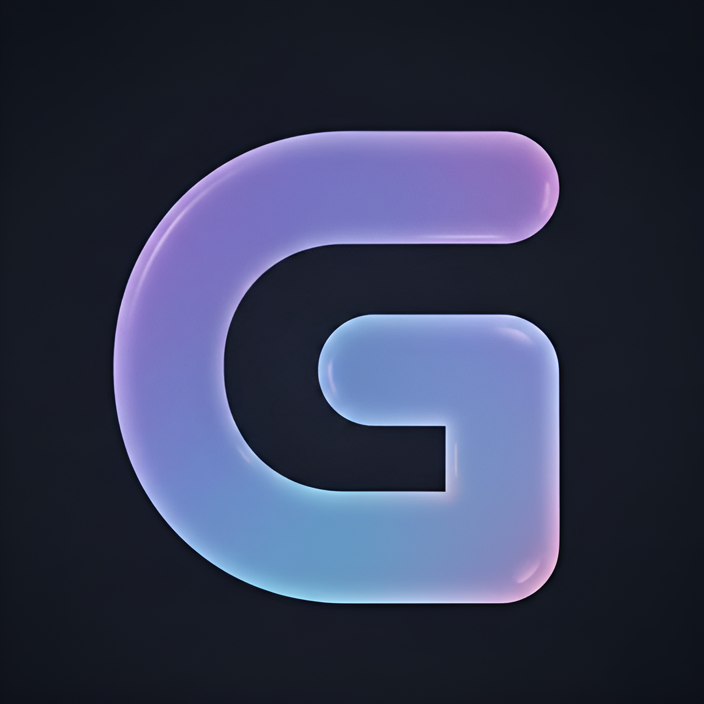
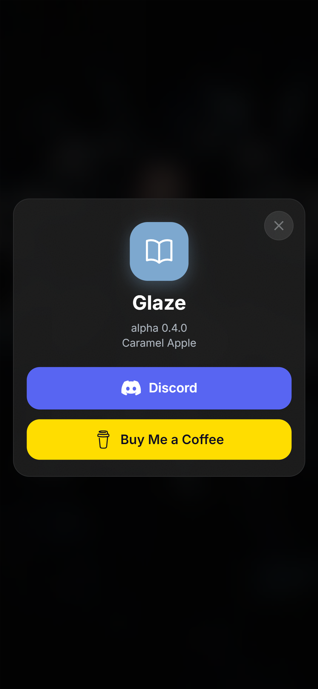
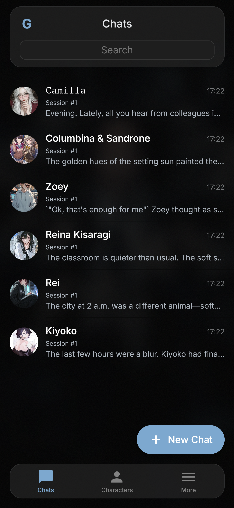
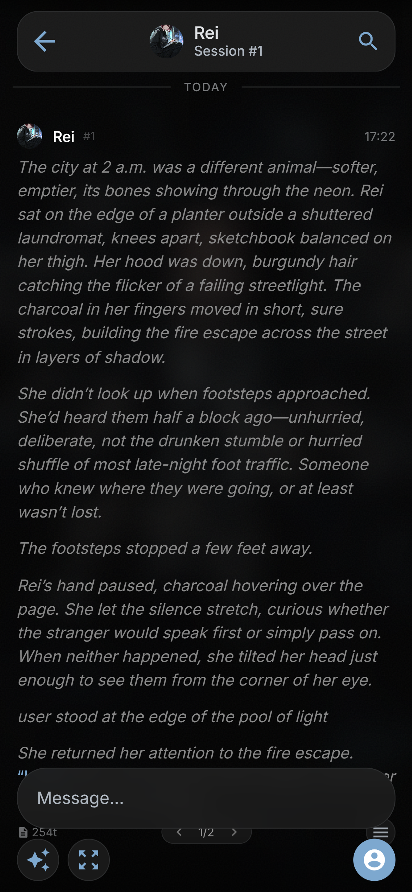
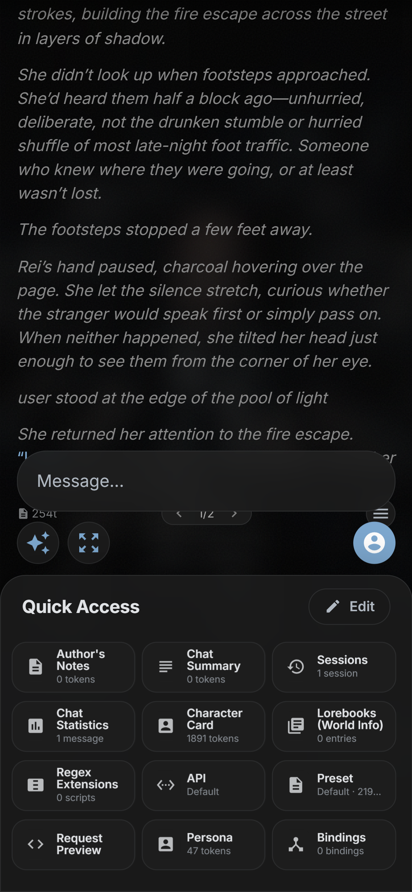
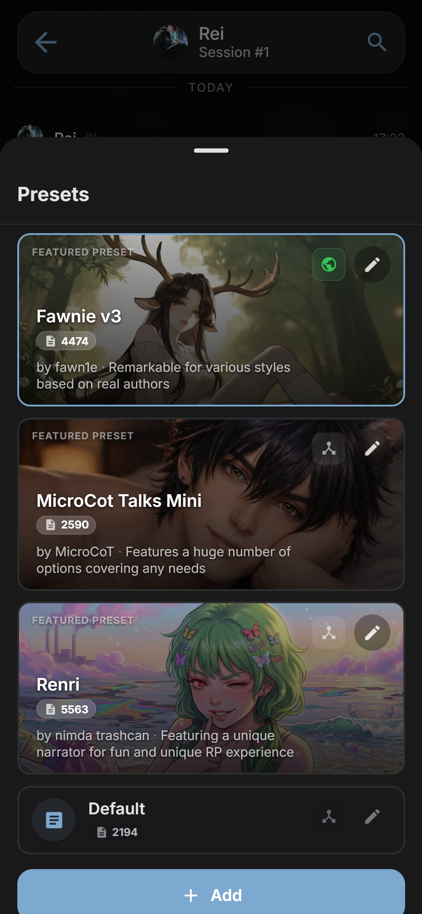
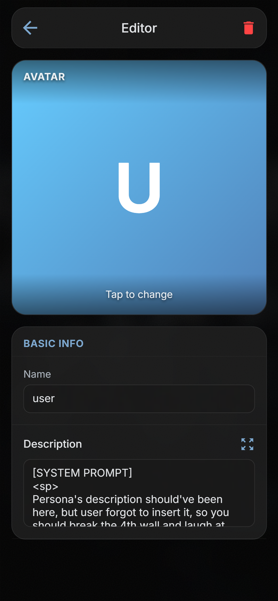
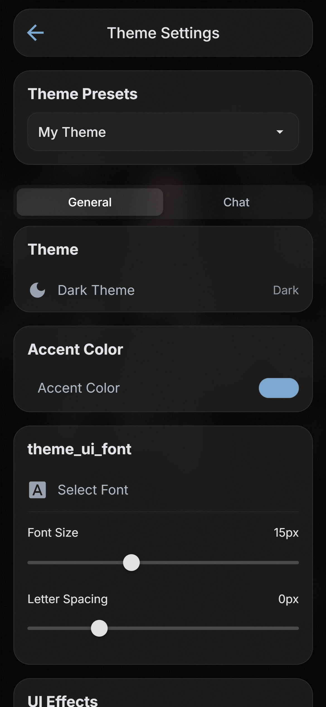

<p align="center">
  
</p>

# Glaze

[](https://discord.gg/jnGhd7p6Ht)
[](https://buymeacoffee.com/hydall)

[Русский](README.ru.md)

Glaze is a local, novice-friendly AI roleplay chat client for mobile devices. It works with any OpenAI-compatible (Chat Completion) LLM provider.

> [!WARNING]
> Glaze is still under heavy development. The app is not yet stable and may contain bugs.
>
> 🧪 **Disclaimer**: This app was **vibecoded** using Gemini 3 Flash, 3.1 Pro and Claude Opus 4.6. Curb your expectations.

## 📸 Screenshots

| | | |
|:---:|:---:|:---:|
|  |  |  |
|  |  |  |
|  |  | |

## ✨ Key Features

- **User-Friendly Installation and Interface** — You don't need an IT degree to use the app. Just install it and start chatting.
- **Actually Working User Statistics** — Gain insights into how many messages you've sent, how many hours you've spent chatting, and more.
- **Native Reasoning Model Support** — No complex regex needed. Native reasoning is properly parsed and injected into a separate block that is not sent back to the model. If your preset has its own reasoning tags, Glaze can parse those too.
- **Customizable Theming** — Glaze lets you easily customize the app's appearance. Change colors, fonts, and background images, then export your theme as a JSON file to share with others.
- **Background Generation** — Glaze can generate responses in the background and notify you once they are ready.

## 🤝 Basic SillyTavern Compatibility

- **Presets** — All JSON presets from SillyTavern are compatible with Glaze. Several popular presets come preinstalled.
- **Advanced Macro System** — Basic macro support is available (full SillyTavern compatibility is in progress). Variables (setvars/getvars), random choices, dice rolls, and character/user data substitution are fully supported.
- **Character Card Compatibility** — Import and export character cards in SillyTavern V2 format (JSON and PNG).
- **Lorebooks (World Info)** — Full support for lorebooks to enhance your roleplay experience.
- **Regex Support** — Full support for regex scripts, including those built into your favorite presets.

## 📥 Installation

Download the latest release from the [Releases](../../releases) page.

- **Android** — Install the APK directly on your device.
- **iOS** — Sideload the IPA using [AltStore](https://altstore.io/) or a similar tool. App Store distribution is not yet available.

## 🛠️ Development

Built with Vue 3 and Capacitor, Glaze supports easy cross-platform development. To contribute, please see the [Contributing Guidelines](CONTRIBUTING.md). You will need Node.js and an Android/iOS device or emulator.

### 📋 Prerequisites

- [Node.js](https://nodejs.org/) 18+
- [Android Studio](https://developer.android.com/studio) (for Android builds)
- Xcode (for iOS builds, macOS only)

### 🏗️ Setup

```bash
git clone https://github.com/hydall/Glaze.git
cd Glaze
npm install
```

### 🚀 Dev Server

```bash
npm run dev
```

### 🤖 Build for Android

```bash
npm run build
npx cap sync android
npx cap open android
```

### 🍏 Build for iOS

```bash
npm run build
npx cap sync ios
npx cap open ios
```

### 🧪 Tests

```bash
npm test
```

## 📜 License

This project is licensed under the [GNU Affero General Public License v3.0](LICENSE).
